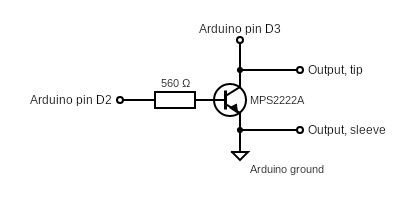
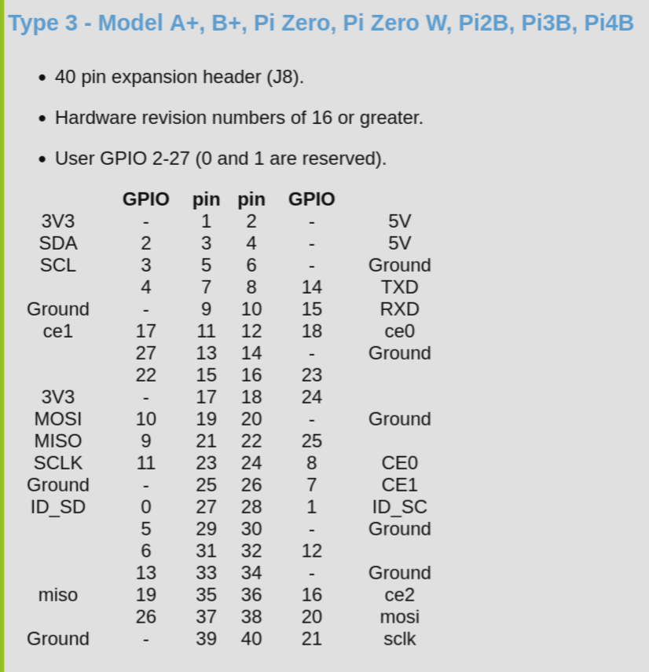

# Overview

I have an old Sony receiver that doesn't have HDMI inputs. Which is fine for me, I use the optical connection to get audio to the receiver. 

The only drawback here is that I have to keep the Sony remote handy in order to change the volume. This project fixes that.

Once the slink service is running, it will start a `cec-client` process, which registers the pi as an audio device with the TV. Then under the settings (gear icon), you can press up, and choose PI Bridge as the audio output. The python script will then translate the volume up, down and "middle press" inputs from the smart controller to the Sony via slink.

You must have the "simultaneous optical" option checked under settings > audio > expert enabled to actually get audio in your receiver. The raspberry pi is not actually handling audio over hdmi.

Also note that the mute button on the smart remote will not unmute. You have to press volume up to unmute.




I am using gpio 2 for output and 3 for input.

I never did get reading slink commands working (Maybe wrong resistor values?). But writing works. Which is really all I need this project for.




## Setup

**The initial part of the make, the compilation of pigpio.c, takes 100 seconds on early model Pis.  Be patient.  The overall install takes just over 3 minutes.**

Install pigpiod

```sh
wget https://github.com/joan2937/pigpio/archive/master.zip
unzip master.zip
cd pigpio-master
make
sudo make install
```

If the Python part of the install fails it may be because you need the setup tools.

```sh
sudo apt install python-setuptools python3-setuptools
```

Install cec-client from apt.

## Running

To start the pigpio daemon.

```sh
sudo pigpiod
sudo ./main.py
```

But you are probably better off setting up the services below

To stop the pigpio daemon.

```sh
sudo killall pigpiod
```

## S-link/Control Aii - Command Reference

https://boehmel.de/slink.htm


## Setup service files

In order to persist reboots, you need to setup systemd services:

```sh
echo """
[Unit]
Description=Daemon required to control GPIO pins via pigpio
[Service]
ExecStart=/usr/local/bin/pigpiod
ExecStop=/bin/systemctl kill -s SIGKILL pigpiod
Type=forking
[Install]
WantedBy=multi-user.target
""" | sudo tee /lib/systemd/system/pigpiod.service


echo """
[Unit]
Description=Slink Python Script Service
# Ensures pigpiod is started before this script
After=network.target pigpiod.service
Requires=pigpiod.service

[Service]
# Standard execution of your script
ExecStart=/usr/bin/python3 $HOME/slink.py
WorkingDirectory=/home/james
StandardOutput=inherit
StandardError=inherit
Restart=always
User=james

[Install]
WantedBy=multi-user.target
""" | sudo tee /lib/systemd/system/slink.service
```

Then enable and start the services.

```sh
sudo systemctl force-reload

sudo systemctl enable --now pigpiod

sudo systemctl enable --now slink
```